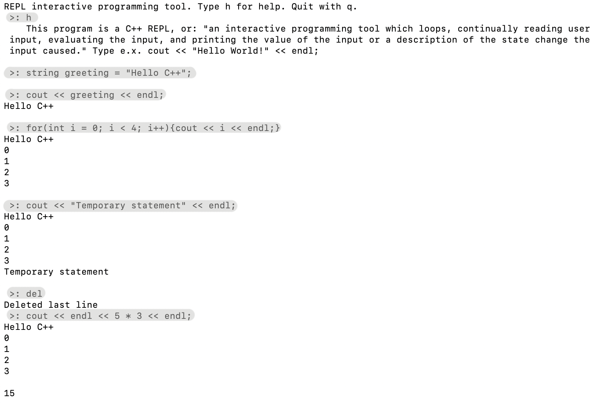

# CPP REPL
A REPL is defined as: "an interactive programming tool which loops, continually reading user input, evaluating the input, and printing the value of the input or a description of the state change the input caused."

Example Usage:

